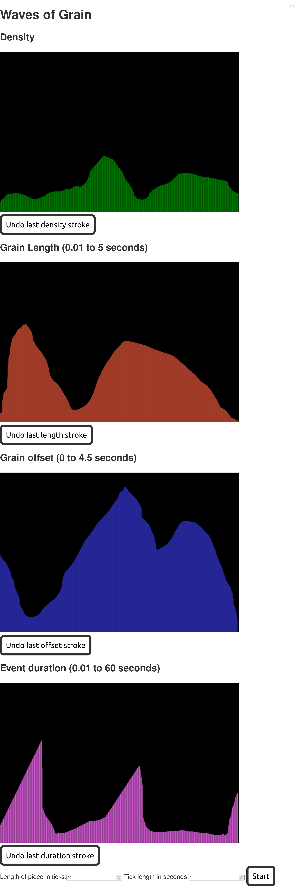

# waves-of-grain

Crude granular synthesis.

## Getting it running

Once you have this source code on your computer, you can get it running by doing the following.

- Install [Node 10 or later](https://nodejs.org/).
- From the root directory of the project (the same one this README file is in), run this command: `npm i`
- Then, run `make run`. It should then say something like `Your application is ready~! Local: http://0.0.0.0:7000`
  - On Windows, you may not have `make`. In that case, you can run `npm run dev`.
  - Go to `http://0.0.0.0:7000` (or `http://localhost:7000`) in your browser. The web app will be running there.
    - It looks roughly like this when it's working:
    
    

It is also [on the web](https://jimkang.com/waves-of-grain/), though the UI is really rough; that's all I have time for right now. If you draw curves on all of the graphs and hit Start, it may make sound.
